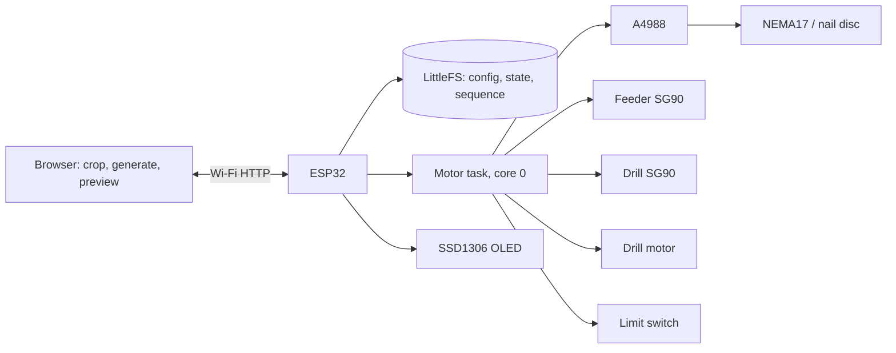

# String Art CNC — ESP32 / NEMA17, with String Art Studio

A Wi-Fi string art machine built around an **ESP32 WROOM-32 (38-pin)**,
**A4988**, **NEMA17**, two **SG90** servos and a drill motor — running the full
**String Art Studio** web interface, served from the ESP32's own flash.

Open the machine's address in a browser and you get the whole workflow in one
page: crop a photo, generate the chord pattern, preview it live, print a base
template, then drill the holes and string the picture. No app, no desktop
software, no internet — the page is served from the ESP32 and the generator
runs in your browser.

---

## Contents

- [Features](#features)
- [Hardware](#hardware)
- [Pinout](#pinout)
- [Architecture](#architecture)
- [Installing](#installing)
- [First run](#first-run)
- [Using it](#using-it)
- [Settings](#settings)
- [HTTP API](#http-api)
- [Files](#files)
- [Safety](#safety)
- [Current limitations](#current-limitations)
- [Licence](#licence)
- [Credits](#credits)

---
Development Setup :


---
## Features

**In the browser**

- Photo crop (Cropper.js), square or circular framing
- Greedy chord generator with minimum nail separation, recent-nail avoidance,
  residual darkening and a circular mask
- Live canvas preview as lines are chosen
- Downloads: `steps.txt`, `pins.txt`, SVG, and an A4 greeting-card PDF
- Printable base-template designer — nail ring, hole positions, centre marks,
  print scaling
- One nail count shared across the generator, the template and the machine
- Dark/light theme; edit-guard so polling never overwrites a field you are
  typing in
- Open the machine's address on a second device mid-job and the artwork is
  rebuilt from the sequence the machine is holding — no photo needed
- Setup panel with the five settings a new machine needs; export/import of
  every setting as JSON

**On the machine**

- Absolute nail ↔ step positioning for **any** nail count, from
  `motorFullSteps × microstep × gearRatio` — not a hardcoded 12
- Wrap cycle: overshoot, swing out, sweep back, swing in, land — a real loop
  around the nail (switchable back to the plain sweep)
- Acceleration ramp on every move, so a disc with inertia starts without stalling
- Manual **Back** / **Next** stepping, one line at a time, wrap and feed included
- Limit-switch homing at its own seek speed, optional home-before-job, optional re-home every N lines
- Drill cycle with its own rest/down angles, spin-up, dwell and slew rate
- Calibration: jog, set-nail, N-turn spin measurement
- Checkpoint verify with least-squares learning of the real steps-per-turn,
  reporting drift in ppm, RMS residual and span in turns
- Settings, sequence and progress persisted to LittleFS — survives a power cut
- Pause / resume / stop; ETA, average time per line, elapsed run clock
- Optional SSD1306 OLED dashboard
- WiFiManager router setup with a `StringArtMachine` fallback hotspot
- FreeRTOS motor task pinned to core 0, so the web server stays responsive

---

## Hardware

| Component | Role |
|---|---|
| ESP32 WROOM-32 (38-pin) | Controller |
| A4988 | NEMA17 driver |
| NEMA17 | Turns the nail disc |
| SG90 #1 | Thread feeder |
| SG90 #2 | Drill lift |
| Motor driver stage | Drill motor |
| Limit switch | Home / absolute zero |
| SSD1306 128×64 I²C | Optional dashboard |

---

## Pinout

| GPIO | Function |
|---:|---|
| **12** | A4988 STEP |
| **14** | A4988 DIR |
| **18** | Feeder SG90 signal |
| **19** | Drill SG90 signal |
| **25** | Drill motor control |
| **26** | A4988 enable (active LOW, driven at boot) |
| **27** | Home limit switch (to GND, internal pull-up) |
| **21 / 22** | OLED SDA / SCL (optional) |

Unchanged from the this firmware sketch apart from the two optional OLED pins, which are
the ESP32's default I²C pair and are otherwise unused.

See [`TECHNICAL_SETUP_GUIDE.md`](TECHNICAL_SETUP_GUIDE.md) for wiring and power.

---

## Architecture



Image work happens entirely in the browser. The ESP32 receives a list of nails,
not a picture.

---

## Installing

**Board**: ESP32 Dev Module (Arduino core for ESP32).

**Libraries**

| Library | Author |
|---|---|
| ESP32Servo | Kevin Harrington |

`WebServer`, `LittleFS`, `Wire`, `Preferences` and FreeRTOS come with the
ESP32 core. WiFiManager is **not** required — it was removed in Studio-1.8.

**Partition scheme** — the web page is served as plain, editable text and costs
about 160 KB of flash. Choose a scheme with at least a **1.9 MB APP** region
and some SPIFFS/LittleFS left over:

- *Minimal SPIFFS (1.9MB APP with OTA/190KB SPIFFS)*, or
- *Huge APP (3MB No OTA/1MB SPIFFS)*

Some filesystem space **must** remain, or settings and sequence persistence
fails silently.

Open **`StringArt_Nema17_A4899_OLED_SG90/StringArt_Nema17_A4899_OLED_SG90.ino`**
— the inner folder — and upload. Arduino requires a sketch to live in a folder
of the same name, which is why it is nested; the documentation and tests sit
outside it so the IDE does not try to compile them. All four files in that
folder must stay together, `machine_types.h` included, for the reason explained
at the top of it.

Shipped defaults are 200 full steps × 1/8 microstepping × 1:1 to the disc =
1600 steps per turn, 360 nails. Change them in **Advanced → Motor** if your
build differs; once saved, the stored settings win over these on every boot.

---

## First run

1. Power up. If no router is saved, the ESP32 hosts the **`StringArtMachine`**
   hotspot with a captive setup page — join it and point the machine at your
   router. The OLED and the serial log both print the address it lands on.
2. Open that address in a browser.
3. **Advanced → Motor**: set full steps per revolution, the microstep jumpers
   fitted to the A4988, and the gear ratio to the disc. Leave them alone if
   your build is the default 200 × 1 × 12:1.
4. **Home**. The disc finds the switch and zero is established.
5. Put a known nail in front of the feeder and press **Set nail**. This is what
   makes every nail number mean a physical place.
6. **Calibrate → spin N turns**, then report where the disc actually finished.
   Do this once before a long job.
7. Load thread and run **Wrap test** on a single nail before committing to a
   3000-line pattern.

If the motor buzzes instead of turning, or homing reports that the switch never
closed, work through [`TROUBLESHOOTING_MOTION.md`](TROUBLESHOOTING_MOTION.md)
before changing settings — the usual causes are coil pairing, driver current
and the gear ratio, in that order.

---

## Using it

**Generate tab** — drop in a photo, crop it, set nail count and line count, and
press Generate. The preview fills in as lines are chosen. Download the base
template and print it at 100 % scale to drill by hand, or send the pattern to
the machine.

**Machine tab** — **Home & drill** walks the ring drilling each hole, then
**Start stringing** runs the pattern. Pause, resume and stop are live. Progress,
the nail pair currently being strung, ETA and average time per line show in the
Live Status panel, which stays visible on both tabs.

**A power cut mid-job** loses at most the line in progress. On reboot the
sequence and position come back from LittleFS. With `autoHomeOnBoot` enabled
the machine re-establishes zero and drives back to the saved line — but it does
not start running again on its own, by design.

---

## Settings

Everything below is editable from **Advanced** and stored in `/config.txt`.

| Group | Settings |
|---|---|
| Motor | full steps, microstep, gear ratio, direction sign, step pulse µs |
| Acceleration | start pulse, ramp length, homing pulse, give-up turns |
| Ring | nail count, nail offset, disc offset |
| Run | dwell between lines, home before job, hold when idle, re-home every N |
| Feeder | rest / feed angle, pulse, settle, recover, auto-feed |
| Drill | rest / down angle, spin-up, dwell, slew |
| Wrap | mode, overshoot steps, sweep, direction, approach direction, holds |
| Servo | slew degrees per step, ms per step |
| Accuracy | verify every N lines, learn steps-per-turn automatically |
| Display | OLED address, flip |

**Restore defaults** writes the shipped values back.

---

## HTTP API

```
GET  /              the page
GET  /status        80-key JSON: state, progress, position, learn, errors
GET  /pins          the loaded sequence as from,to pairs
POST /pins          load a sequence as from,to pairs
POST /upload        load a flat nail list (what the Studio's Send button posts)
POST /config        set any adjustable setting by name
POST /action        cmd=drill|string|findhome|home|stop|pause|resume|
                        next|prev|gotostep|goto|jog|setnail|calmove|calreport|
                        servotest|drillservotest|feed|drilltest|
                        wraptest|wrappreview|verify|learnapply|learnforget
POST /drill /string /stop /pause /resume /wifi-setup
```

The five routes on the last line are kept exactly as this firmware had them, so existing
scripts keep working. CORS preflight is answered on every POST route.

Sequence files may have a header row or `#` comments; both are skipped. Nails
outside the ring are refused with an explanatory 400 rather than clamped.

---

## Files

```text
StringArt_Nema17_GUI/                 repository root
├── StringArt_Nema17_GUI/             the Arduino sketch folder — open this one
│   ├── StringArt_Nema17_GUI.ino      firmware
│   ├── machine_types.h               the enums used in function signatures
│   ├── web_page.h                    the String Art Studio page (PROGMEM)
│   └── oled_display.h                SSD1306 driver + 5×7 font
├── README.md                   this file
├── TROUBLESHOOTING_MOTION.md   motor shakes, homing fails, gear ratio
├── CHANGELOG.md                change history
├── TECHNICAL_SETUP_GUIDE.md    wiring, power, calibration, troubleshooting
├── THIRD_PARTY_NOTICES.md      bundled third-party licences
└── tests/                      host-side checks (no ESP32 needed)
    ├── run.sh
    ├── tests.cpp
    ├── check_prototypes.py
    ├── check_page.py
    ├── shims/
    └── README.md
```

---

## Safety

- The drill mechanism and the nail wheel both move without warning. Keep hands
  clear while powered.
- Disconnect power before changing motor wiring.
- Set the A4988 current limit for your NEMA17 before running it hard.
- Secure the disc and the base before a long job.

> **Stop** and **Pause** are software controls. Neither removes motor power,
> and both depend on the ESP32 and this firmware running correctly. They are
> convenience controls for normal operation, **not** an emergency stop. Fit a
> hardware one.

---

## Current limitations

- **Not compiled for an ESP32 in the environment this port was written in.**
  Host syntax checks and unit tests pass; see
- Flash is tight — the ungzipped page needs ~160 KB and a 1.9 MB APP partition.
- Software stop is not a hardware emergency stop.
- The drill motor output needs an external switching stage.
- One servo axis for the wrap, so the disc makes half of each loop: two short
  extra moves per nail.
- Learning needs ≥ 5 checkpoints over ≥ 2 turns before it will suggest a
  steps-per-turn change. On short jobs it measures and stays quiet.

---

## Licence

Free software under the **GNU General Public License, version 3 or (at your
option) any later version**. It comes with no warranty.

Anyone can use, study, change and share it, including commercially, but
anything distributed that is built from it must also be under the GPL with its
source available. The web page shows this notice at the bottom of the sidebar,
as the GPL asks of interactive programs.

Each source file starts with an `SPDX-License-Identifier` line. Two files also
contain other people's work under their own licences:

| File | Licence |
|---|---|
| `web_page.h` | GPL-3.0-or-later AND MIT (bundles Cropper.js) |
| `oled_display.h` | GPL-3.0-or-later AND BSD-2-Clause (the 5×7 font) |

Add the full GPL-3.0 text as `LICENSE` before publishing the repository.

---

## Credits

This project builds on other people's work. Full texts are in
[`THIRD_PARTY_NOTICES.md`](THIRD_PARTY_NOTICES.md).

- **Cropper.js** 1.6.1 by **Chen Fengyuan** — MIT. Bundled into the web page,
  unmodified, with its copyright banner.
  
- **5×7 font** ("glcdfont") by **Adafruit Industries**, from
  Adafruit-GFX-Library — BSD 2-Clause. The OLED driver around it was written
  for this project.
  
- **WiFiManager** by **tzapu** — MIT, used as a library.

- **ESP32Servo** by **Kevin Harrington** — LGPL-2.1, used as a library.

- **String Art Studio**, the base template designer and the chord generator by
  **Chanchal Sakarde**.
  
- **Complete Design and Coding** : Chanchal Sakarde. All Copy Rights Reserved.

  
