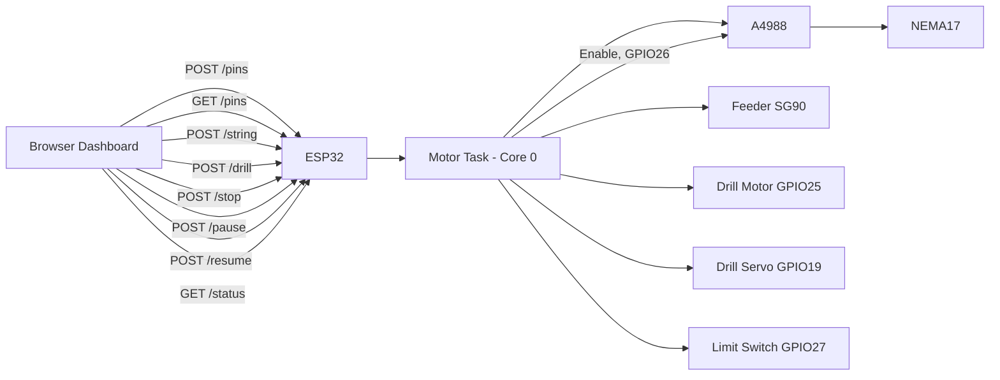
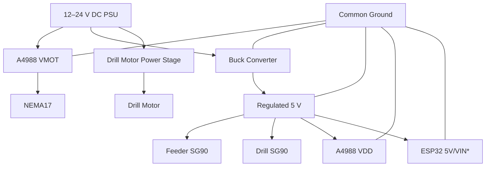

# StringArt CNC — Technical Setup Guide

**Project:** StringArt CNC Wi-Fi Controller  
**Firmware:** `StringArt_Nema17_A4899_OLED_SG90.ino`  
**Controller:** ESP32 WROOM-32, 38-pin development board  
**Stepper:** NEMA17  
**Driver:** A4988  
**Feeder Servo:** SG90  
**Drill Servo:** SG90-compatible servo on GPIO19  
**Home Sensor:** Mechanical limit switch on GPIO27

> **Scope:** This guide documents this firmware and its actual pin assignments, machine states, HTTP API, motion sequence, wiring, calibration, testing, and troubleshooting.

---

## 1. System Overview

The firmware turns the ESP32 into a self-contained String Art CNC controller:



### High-level operating sequence

1. ESP32 boots and drives `ENABLE_PIN` (GPIO26) LOW to enable the A4988.
2. Wi-FiManager connects to the last configured router or creates the `StringArtMachine` setup portal.
3. The browser dashboard is served directly by the ESP32.
4. The browser generates the String Art nail path, or a previously exported `pins.txt` is imported instead.
5. The generated or imported pin pairs are sent to `POST /pins`.
6. `POST /string` requests homing followed by stringing.
7. The motor task homes the machine using GPIO27.
8. The NEMA17 moves to each target nail using STEP/DIR.
9. The feeder SG90 performs the string-feeding sequence.
10. `POST /pause` / `POST /resume` can freeze and continue the job at any point in steps 7–9.
11. Progress is exposed through `/status`; the currently loaded job can be re-downloaded through `GET /pins`.
12. The machine ends in `done`, `idle`, or `error`.

---

## 2. Hardware BOM

| Component | Recommended specification |
|---|---|
| ESP32 | ESP32 WROOM-32, 38-pin development board |
| Stepper motor | NEMA17, typically 1.8°/step |
| Stepper driver | A4988 |
| Feeder servo | SG90, 5 V |
| Drill servo | SG90-compatible servo, 5 V |
| Drill motor | External motor controlled by GPIO25 through a suitable driver/MOSFET/relay |
| Limit switch | Mechanical NO/COM switch |
| Motor PSU | 12 V–24 V DC, sized for NEMA17 and driver |
| Servo PSU | Regulated 5 V supply, preferably 1 A or greater |
| Buck converter | 12/24 V to regulated 5 V if using one main PSU |
| USB | ESP32 programming/debug connection |

---

## 3. ESP32 Pin Map

### Firmware pin definitions

```cpp
#define STEP_PIN           12
#define DIR_PIN            14
#define FEEDER_SERVO_PIN   18
#define DRILL_SERVO_PIN    19
#define DRILL_MOTOR_PIN    25
#define ENABLE_PIN         26
#define LIMIT_SWITCH_PIN   27
```

### Detailed operations

| ESP32 GPIO | Firmware symbol | Device | Operation | Direction |
|---:|---|---|---|---|
| GPIO12 | `STEP_PIN` | A4988 STEP | Generates step pulses for NEMA17 | Output |
| GPIO14 | `DIR_PIN` | A4988 DIR | Selects motor direction | Output |
| GPIO18 | `FEEDER_SERVO_PIN` | Feeder SG90 | Moves string feeder between 20° and 180° | Servo PWM |
| GPIO19 | `DRILL_SERVO_PIN` | Drill SG90 | Moves drill mechanism between 20° and 180° | Servo PWM |
| GPIO25 | `DRILL_MOTOR_PIN` | Drill motor driver | Turns drill motor ON/OFF | Output |
| GPIO26 | `ENABLE_PIN` | A4988 EN | Enables/disables the driver (active LOW); driven LOW at boot | Output |
| GPIO27 | `LIMIT_SWITCH_PIN` | Home limit switch | Detects mechanical home position | Input with pull-up |
| GND | — | Common ground | Signal reference | Ground |
| 5V/VIN | — | Logic/servo supply | Supply according to board and power design | Power |

> **GPIO25 must not drive a motor directly.** Use a MOSFET, relay module, or suitable motor driver with flyback protection as appropriate for the drill motor.

> **GPIO26 replaces a hardware EN jumper.** If your board previously had `EN` tied to ground with a physical jumper, remove it before relying on firmware control — driving GPIO26 while it's also hard-wired to ground works today (both agree on LOW), but risks a short if a future firmware revision ever drives it HIGH.

---

## 4. Recommended Wiring

### 4.1 ESP32 → A4988

| ESP32 | A4988 | Purpose |
|---|---|---|
| GPIO12 | STEP | Step pulse |
| GPIO14 | DIR | Direction |
| GPIO26 | EN | Enable (active LOW; driven LOW at boot by firmware) |
| 5V | VDD | A4988 logic supply |
| GND | GND | Logic ground |

For a basic standalone configuration, tie `RESET` and `SLEEP` together and configure the microstep pins according to the desired resolution. `EN` no longer needs to be jumpered to ground — remove any existing jumper on that pin before wiring GPIO26 to it.

### 4.2 A4988 → NEMA17

The four motor outputs are:

```text
A4988 1A ───── Coil A1
A4988 1B ───── Coil A2

A4988 2A ───── Coil B1
A4988 2B ───── Coil B2
```

Do **not** assume wire colors. Identify the two coil pairs using the motor datasheet or a multimeter.

### 4.3 ESP32 → Feeder SG90

```text
SG90 Signal ───── GPIO18
SG90 VCC    ───── regulated 5 V
SG90 GND    ───── common GND
```

### 4.4 ESP32 → Drill Servo

```text
Drill Servo Signal ───── GPIO19
Drill Servo VCC    ───── regulated 5 V
Drill Servo GND    ───── common GND
```

### 4.5 Drill Motor

```text
GPIO25 ───> MOSFET / Relay / Motor Driver ───> Drill Motor
```

Never connect a motor directly to GPIO25.

### 4.6 Home Limit Switch

The firmware uses:

```cpp
pinMode(LIMIT_SWITCH_PIN, INPUT_PULLUP);
```

Recommended wiring:

```text
GPIO27 ───── NO contact
GND    ───── COM contact
```

Logic:

| Physical state | GPIO27 |
|---|---:|
| Switch released | HIGH |
| Switch pressed | LOW |

---

## 5. Power Architecture

A recommended architecture is:



### Critical power rules

- Do **not** power the NEMA17 from the ESP32.
- Do **not** power an SG90 from the ESP32 3.3 V rail.
- Use a stable 5 V supply for the servos.
- Tie signal grounds together.
- Place appropriate bulk capacitance near the A4988 motor supply according to the A4988 module/vendor guidance.
- Set the A4988 current limit for the actual NEMA17; do not blindly use a generic VREF value.
- Never connect or disconnect the NEMA17 while A4988 VMOT is powered.

---

## 6. A4988 Configuration

The firmware sends STEP/DIR signals only; the actual microstepping resolution is configured by MS1/MS2/MS3 on the driver.

Typical A4988 modes:

| MS1 | MS2 | MS3 | Resolution |
|---|---|---|---|
| LOW | LOW | LOW | Full step |
| HIGH | LOW | LOW | 1/2 |
| LOW | HIGH | LOW | 1/4 |
| HIGH | HIGH | LOW | 1/8 |
| HIGH | HIGH | HIGH | 1/16 |

### Important calibration point

The firmware currently assumes:

```cpp
const int STEPS_PER_NAIL = 12;
```

This value must correspond to the **actual number of A4988 step pulses required to move from one nail position to the next**.

If the A4988 microstep setting, gearing, belt ratio, pulley, or mechanical transmission changes, recalibrate `STEPS_PER_NAIL`.

---

## 7. Machine Configuration

Current defaults:

```cpp
const int STEPS_PER_NAIL = 12;
int numNails = 200;
```

The dashboard defaults to:

```text
Nails:       200
Lines:       1800
Resolution:  300 px
Line weight: 0.08
```

The dashboard permits:

```text
Nails: 50–400
Lines: 200–6000
Resolution: 150–500 px
Line weight: 0.02–0.30
```

> Keep the dashboard nail count and physical nail count synchronized. The firmware's `numNails` is also updated from `/drill?nails=N`.

---

## 8. Firmware Architecture

The firmware uses:

- `WiFi.h`
- `WebServer.h`
- `WiFiManager.h`
- `ESP32Servo.h`
- `vector`
- `utility`
- `esp_system.h`

### Task architecture

The web server runs from:

```cpp
void loop() {
    server.handleClient();
}
```

The machine motion is executed by a FreeRTOS task pinned to Core 0:

```cpp
xTaskCreatePinnedToCore(
    motorTask,
    "motorTask",
    8192,
    NULL,
    1,
    NULL,
    0
);
```

This separation allows the web dashboard to remain responsive while the machine is moving.

---

## 9. Watchdog/Reboot Protection

The firmware adds periodic FreeRTOS yielding to long-running motion loops.

### Homing

Every 10 steps:

```cpp
vTaskDelay(pdMS_TO_TICKS(1));
```

### Normal rotation

Every 10 steps:

```cpp
vTaskDelay(pdMS_TO_TICKS(1));
```

### Single-step operations

Every 10 steps:

```cpp
vTaskDelay(pdMS_TO_TICKS(1));
```

### Why this matters

A long blocking loop on Core 0 can starve ESP32/FreeRTOS housekeeping and trigger a watchdog reset. The fixed firmware yields periodically while continuing the motion.

---

## 10. Homing Operation

When `/string` or `/drill` starts, the machine enters:

```text
STATE_HOMING
```

The firmware rotates:

```cpp
digitalWrite(DIR_PIN, LOW);
```

toward the home switch.

Maximum homing distance:

```cpp
maxSteps = STEPS_PER_NAIL * numNails * 2;
```

For 200 nails:

```text
12 × 200 × 2 = 4800 steps maximum
```

If GPIO27 becomes LOW:

```text
Homing complete
```

If the limit switch never triggers:

```text
Homing failed: limit switch never triggered.
```

and the machine enters:

```text
STATE_ERROR
```

### Safety requirement

The physical machine must be designed so that the limit switch is reached **before the mechanical travel limit**.

The firmware's step-count limit is only a software safety margin; it is not a substitute for a physical hard stop.

---

## 11. Stringing Motion Algorithm

Each generated line contains:

```text
FROM,TO
```

Example:

```text
76,148
148,194
194,20
```

The firmware converts the nail difference to motor steps:

```cpp
int steps = STEPS_PER_NAIL * (toPos - fromPos);
```

With 12 steps per nail:

```text
76 → 148
Difference = 72 nails
Steps = 72 × 12
      = 864 steps
```

### Circular shortest-path logic

The current firmware assumes:

```text
200 nails × 12 steps/nail = 2400 steps/revolution
```

and uses 1200 steps as the half-revolution threshold.

If a direct path exceeds 1200 steps, it reverses direction and uses the shorter wrap-around path.

> **Important:** This is correct only when the physical configuration matches the 200-nail / 12-step-per-nail assumption. For a future variable-nail design, replace the hard-coded `1200` and `2400` values with calculated constants.

### Live tracking of the current line

Immediately before computing `steps` for a given line, the firmware records which nails are involved:

```cpp
currentFromNail = fromPos;
currentToNail = toPos;
```

This is what powers the dashboard's "Nail X → Y" display (see Section 16) — it is purely a status-reporting side effect and does not affect motion. Both values reset to `-1` when stringing completes or is stopped.

---

## 12. Feeder Servo Sequence

For each string connection:

```text
1. Move NEMA17 to destination nail
2. Wait 500 ms
3. Feeder SG90: 180° → 20°
4. Wait 100 ms
5. NEMA17: +12 steps
6. Feeder SG90: 20° → 180°
7. Wait 100 ms
8. NEMA17: -12 steps
9. Wait 500 ms
10. Process next line
```

Servo movement uses:

```cpp
for (int a = 180; a >= 20; a -= 2)
```

and:

```cpp
for (int a = 20; a <= 180; a += 2)
```

with a 15 ms delay between positions.

---

## 13. Drilling Operation

The dashboard's **Home & drill holes** operation performs:

```text
Home
  ↓
For each nail:
  ↓
Drill motor ON
  ↓
Drill servo 20° → 180°
  ↓
Drill servo 180° → 20°
  ↓
Drill motor OFF
  ↓
Move NEMA17 by 12 steps
  ↓
Next nail
```

GPIO25 controls the drill motor output:

```cpp
digitalWrite(DRILL_MOTOR_PIN, HIGH);
```

and:

```cpp
digitalWrite(DRILL_MOTOR_PIN, LOW);
```

The drill motor must therefore be connected through a proper power switching stage.

---

## 14. Machine States

The firmware defines:

```cpp
enum MachineState {
    STATE_IDLE,
    STATE_HOMING,
    STATE_DRILLING,
    STATE_STRINGING,
    STATE_PAUSED,
    STATE_DONE,
    STATE_ERROR
};
```

### State meanings

| State | Meaning |
|---|---|
| `idle` | Machine is waiting for a command |
| `homing` | Moving toward the home switch |
| `drilling` | Drilling nail holes |
| `stringing` | Executing generated pin pairs |
| `paused` | Motion frozen mid-job; resumes from the same point via `/resume` |
| `done` | Current job completed |
| `error` | Job failed; inspect `error` returned by `/status` |

---

## 15. Wi-Fi Setup

The firmware uses WiFiManager.

Default AP name:

```cpp
const char* AP_SSID = "StringArtMachine";
```

The intended startup behavior is:

```text
Boot
 ↓
Try saved router credentials
 ↓
Connected?
 ├── YES → Use router IP
 └── NO  → WiFiManager setup portal
             ↓
         Configure router
```

If configuration times out, the firmware falls back to a standalone hotspot.

### Current AP password setting

The source currently contains:

```cpp
const char* AP_PASSWORD = "";
```

For a production machine, set an appropriate AP password and verify the WiFiManager version's password requirements.

---

## 16. Dashboard

The dashboard is embedded in the firmware as `INDEX_HTML` and served from:

```text
GET /
```

### Layout

As of this firmware, the dashboard is organized as:

- A **Live Status panel** (`.panel`, always visible, not part of the tab system) showing the state pill, the current nail pair being strung, the progress bar and count, pins loaded, network info, and the connection/error message.
- A **tab bar** (`.tabbar`) with two buttons, `#tabBtnGenerate` and `#tabBtnMachine`, toggling `display` on `#tabGenerate` and `#tabMachine`.
- The **Generate tab** (`#tabGenerate`): image source, nail/line/resolution/weight inputs, Generate button, preview canvas, and pins.txt export/import.
- The **Machine tab** (`#tabMachine`): Home & drill, Send pins & start stringing, Pause/Resume, Stop, export-loaded-pins, and Wi-Fi setup.

This replaced an earlier two-column grid layout where machine status was only visible while looking at the Machine panel. Consolidating status into one persistent panel means progress — including which nail is currently being strung — stays visible no matter which tab is open.

### Main controls

| Control | Location | Operation |
|---|---|---|
| Source image | Generate tab | Select image from browser |
| Nails | Generate tab | Number of circular nail positions |
| Lines | Generate tab | Number of generated string lines |
| Resolution | Generate tab | Browser image processing size |
| Line weight | Generate tab | String-art preview weight |
| Generate string art | Generate tab | Runs the browser-side nail-path algorithm |
| Export pins.txt | Generate tab | Downloads the current generated/imported pin sequence from the browser |
| Import pins.txt | Generate tab | Loads a previously exported pin sequence into the browser |
| Home & drill holes | Machine tab | Homing + drilling sequence |
| Send pins & start stringing | Machine tab | Uploads generated pin pairs and starts stringing |
| Pause/Resume | Machine tab | Freezes motion at the next step boundary, or continues a paused job |
| Stop machine | Machine tab | Requests a safe stop |
| Export pins currently loaded on machine | Machine tab | Downloads whatever job is actually loaded in device RAM (`GET /pins`) |
| Wi-Fi setup | Machine tab | Clears saved Wi-Fi and restarts setup |

### Live Status panel fields

| Field | Source | Notes |
|---|---|---|
| State pill | `data.state` | `idle` / `homing` / `drilling` / `stringing` / `paused` / `done` / `error` |
| Current nail pair | `data.currentFrom`, `data.currentTo` | Shown as "Nail X → Y" while `state === 'stringing'`; falls back to a hole count while drilling, a homing message while homing, and the last-known pair or hole count while paused |
| Progress bar/count | `data.progress`, `data.total` | Line or hole count depending on phase |
| Pins loaded | `data.pinsLoaded` | Count currently held in the device's `pinSequence` vector |
| Network | `data.mode`, `data.ip` | "Home router" or "Hotspot" plus IP |
| Connection message | `data.error` | Shows the error text when present, otherwise "Connected — no errors reported." on every successful poll |

### Embedded script authoring constraint (critical)

Every JavaScript function inside `INDEX_HTML` **must** be written as `const name = (...) => { ... }`, never as `function name(...) { ... }`.

This is not a style preference. The Arduino IDE's `ctags`-based automatic prototype generator scans the raw text of the `.ino` file for anything shaped like `identifier name(args) {` to auto-generate C++ forward declarations, and it does not understand C++11 raw string literals. Plain `function` declarations inside the embedded page have been misidentified as C++ functions needing prototypes, causing the tool to splice literal `#line N "path"` text directly into the served page's string content — corrupting it at JavaScript parse time and silently breaking the entire dashboard (see CHANGELOG `[CGv8]`). Whether a given `function` declaration actually triggers this is inconsistent and not worth relying on — use the arrow-function form unconditionally, including inside the Web Worker code string.

---

## 17. HTTP API

### `GET /`

Returns the embedded dashboard.

### `GET /status`

Returns JSON similar to:

```json
{
  "state": "stringing",
  "progress": 125,
  "total": 1800,
  "pinsLoaded": 1800,
  "currentFrom": 76,
  "currentTo": 148,
  "mode": "router",
  "ip": "192.168.1.34",
  "error": ""
}
```

`state` may also be `"paused"` while a job is frozen mid-run.

`currentFrom`/`currentTo` are the nail indices of the line currently being executed during stringing. Both are `-1` at all other times (idle, homing, drilling, done, error, or between stringing lines briefly while paused-and-resumed state settles). They are set immediately before each line's motion begins in `runStringingPhase()` and cleared on completion or stop — they do not indicate drilling progress, which is tracked purely through `progress`/`total` instead.

### `POST /pins`

Uploads pin pairs.

Example body:

```text
76,148
148,194
194,20
20,100
```

A space separator is also accepted:

```text
76 148
148 194
```

### `GET /pins`

Exports whatever pin pairs are currently loaded on the device, in the same `from,to` format `POST /pins` accepts. Response includes `Content-Disposition: attachment; filename=pins.txt` so a browser-triggered request downloads directly as a file.

This reflects the device's in-RAM `pinSequence` at the moment of the request — it is independent of whatever the browser's own copy currently holds, and is empty until a job has been uploaded via `POST /pins` at least once since the last boot.

### `POST /drill?nails=200`

Starts:

```text
Home → Drill 200 holes
```

### `POST /string`

Starts:

```text
Home → Execute loaded pin sequence
```

### `POST /stop`

Sets the stop request flag. Also clears any pending pause request, so a stop issued mid-pause does not leave the machine waiting indefinitely for a resume.

### `POST /pause`

Requests a pause. Valid while `state` is `homing`, `drilling`, or `stringing`; returns `409` otherwise. The machine transitions to `paused` at the next step boundary (typically within a few motor steps).

### `POST /resume`

Clears a pending pause. Valid only while `state` is `paused`; returns `409` otherwise. The machine resumes exactly where it left off — homing continues toward the switch, drilling continues from the current hole, stringing continues from the current line.

### `POST /wifi-setup`

Clears saved Wi-Fi credentials and restarts the ESP32 into WiFi setup mode.

---

## 18. Status Polling

The dashboard periodically requests:

```text
GET /status
```

This is expected behavior.

It allows the browser to update:

- machine state
- progress
- total operations
- loaded pin count
- IP/mode
- error message

Continuous `/status` messages in Serial Monitor therefore do **not** by themselves indicate a fault.

---

## 19. Stop Behavior

Pressing **Stop machine** sends:

```text
POST /stop
```

The firmware sets:

```cpp
stopRequested = true;
```

Long-running motion loops periodically check this flag.

The machine is therefore designed to stop at safe software checkpoints.

> For a physical CNC, add a dedicated hardware emergency-stop circuit that removes motor power independently of the ESP32. The HTTP stop function should not be treated as the sole emergency-stop mechanism.

---

## 20. Pause/Resume Behavior

Pressing **Pause** sends:

```text
POST /pause
```

which sets:

```cpp
pauseRequested = true;
```

Every stepping loop (homing, `rotateSteps`, `singleStep`) and the top of each phase loop (drilling, stringing) call a shared helper:

```cpp
void waitWhilePaused() {
  if (!pauseRequested) return;
  stateBeforePause = machineState;
  machineState = STATE_PAUSED;
  while (pauseRequested && !stopRequested) {
    vTaskDelay(pdMS_TO_TICKS(50));
  }
  if (!stopRequested) {
    machineState = stateBeforePause;
  }
}
```

This freezes the motor at the next checkpoint — typically within a few motor steps — without discarding the loaded job or losing position. `stateBeforePause` records whether the machine was homing, drilling, or stringing so that resuming continues the correct phase rather than restarting from the top.

Pressing **Resume** sends:

```text
POST /resume
```

which clears `pauseRequested`, allowing the blocked loop to fall through and restore `machineState` to whatever it was before the pause.

### Interaction with Stop

Sending `/stop` while paused also clears `pauseRequested`, so the machine does not remain stuck waiting for a resume that will never come — it falls through the pause loop and returns to `idle` via the normal stop path.

### Safety note

`/pause` and `/resume` are software-level controls, subject to the same caveat as `/stop`: they depend on the ESP32, its firmware, and (for browser-triggered use) the Wi-Fi link all functioning correctly. Neither is a substitute for a hardware emergency-stop circuit that removes motor power independently of the firmware.

---

## 21. Installation

### Arduino IDE

Recommended:

- Arduino IDE 2.x
- ESP32 board package installed
- Board: ESP32 Dev Module
- Correct COM port selected

### Required libraries

Install through Arduino Library Manager:

```text
WiFiManager
ESP32Servo
```

`WiFi`, `WebServer`, `esp_system`, `vector`, and `utility` are supplied by the ESP32/Arduino environment.

---

## 22. Upload Procedure

1. Connect ESP32 using USB.
2. Select **ESP32 Dev Module**.
3. Select the correct COM port.
4. Compile the firmware.
5. Upload.
6. Open Serial Monitor at **9600 baud**.
7. Record the IP address.
8. Open the displayed IP address in a browser.

---

## 23. First Power-On Test

Perform tests in this order.

### Test A — ESP32 only

Verify:

```text
Boot
Wi-Fi
Dashboard
/status
```

Do not connect the motor supply yet.

### Test B — Limit switch

Press/release the home switch and verify GPIO27 changes:

```text
Released = HIGH
Pressed  = LOW
```

### Test C — Feeder servo

Verify:

```text
180° → 20° → 180°
```

### Test D — NEMA17

Use a low-risk test sequence and verify direction and one-nail movement.

### Test E — Homing

Press **Home & drill holes** with the drill motor disconnected or mechanically safe.

### Test F — Drilling

Only after homing is reliable, connect the drill power stage.

### Test G — Stringing

Upload a very small pin sequence first:

```text
0,10
10,20
20,30
30,40
```

Then gradually increase the job size.

### Test H — Pause/Resume

During a small test job, send `POST /pause` (or press **Pause** on the dashboard) and confirm the motor stops within a few steps. Send `POST /resume` (or press **Resume**) and confirm the job continues from the same position rather than restarting.

### Test I — pins.txt export/import

With a small job loaded, use **Export pins.txt** to download it, then **Import pins.txt** to load that same file back in, and confirm the preview and pin count match. Separately, use **Export pins currently loaded on machine** and confirm the downloaded file matches what was uploaded via `/pins`.

---

## 24. ESP32 Reboot Troubleshooting

If pressing **Send pins & start stringing** causes a reboot, check:

### A. Watchdog

Look for reset information at boot:

```text
ESP32 reset reason: ...
```

The firmware yields during long motion loops to reduce watchdog starvation.

### B. Servo brownout

Use an external regulated 5 V supply for the SG90.

### C. Common ground

Confirm:

```text
ESP32 GND
A4988 GND
Servo GND
5 V PSU GND
Motor driver control GND
```

share the correct signal reference.

### D. Limit switch

If GPIO27 never goes LOW, homing runs until its maximum step limit.

### E. Motor current

Incorrect A4988 current limiting can cause driver overheating, missed steps, or electrical instability.

### F. Mechanical jam

Disconnect power before inspecting the mechanism.

---

## 25. A4988 and NEMA17 Troubleshooting

### Motor vibrates but does not rotate

Likely causes:

- Coil pairs are incorrectly connected.
- A4988 current limit is too low.
- Motor supply is inadequate.
- Mechanical load is excessive.

### Motor rotates in wrong direction

Swap the logical direction in firmware or reverse one motor coil pair, depending on the desired electrical/mechanical configuration.

### Motor skips steps

Check:

- A4988 current limit
- acceleration/speed
- mechanical friction
- belt/gear alignment
- power supply
- microstepping configuration

---

## 26. Servo Troubleshooting

### SG90 resets ESP32

Use a separate 5 V regulator/supply and common ground.

### Servo moves beyond the mechanism

Reduce:

```text
180°
20°
```

to mechanically safe limits.

Do not assume the numeric servo angle exactly equals the physical mechanism angle.

---

## 27. Limit Switch Troubleshooting

Expected:

```text
GPIO27 = HIGH → released
GPIO27 = LOW  → pressed
```

If it remains HIGH:

- check COM/NO wiring
- check ground
- check switch mechanical alignment
- verify GPIO27 is not being used by another circuit

If it remains LOW:

- switch may be permanently pressed
- wiring may be shorted to ground
- wrong switch terminal may be used

---

## 28. Important Mechanical Safety

The machine contains moving and potentially rotating parts.

Before running a full job:

- Keep fingers away from the rotating nail wheel.
- Secure the NEMA17 mechanism.
- Secure the string path.
- Protect the drill mechanism.
- Use a physical emergency stop.
- Do not work on wiring while motor power is enabled.
- Disconnect power before changing A4988 motor wiring.
- Keep loose clothing/string away from rotating components.

---

## 29. Recommended Future Firmware Refactoring

The current firmware is functional, but the following improvements are recommended:

### Replace hard-coded circular-motion constants

Current:

```cpp
if (steps > 1200)
    rotateSteps(2400 - steps);
```

Recommended:

```cpp
const int NUM_NAILS = 200;
const int STEPS_PER_NAIL = 12;
const int TOTAL_STEPS = NUM_NAILS * STEPS_PER_NAIL;
const int HALF_STEPS = TOTAL_STEPS / 2;
```

Then calculate all wrap-around values from the machine configuration.

### Add persistent machine configuration

Store:

- nail count
- steps per nail
- servo limits
- motor speed
- homing direction
- microstep setting

in nonvolatile configuration storage.

### Add job persistence

The current pin sequence is held in RAM. A future version should store a job in a filesystem such as LittleFS so a reboot can recover the last uploaded job if desired.

> **The firmware does not store `/pins.txt` in SPIFFS/LittleFS.** Pin pairs received by `/pins` are held in the RAM vector `pinSequence`. CGv6's browser-side import/export and the `GET /pins` device export move a job between the browser and this RAM vector — they do not add on-device persistence across a reboot.

### Add hardware E-stop

Use a normally closed emergency-stop chain to disable motor/driver power independently of software.

---

## 30. Current Feature Summary

| Feature | Status |
|---|---|
| ESP32 Wi-Fi dashboard | Implemented |
| WiFiManager | Implemented |
| Router auto-connect | Implemented |
| Standalone hotspot fallback | Implemented |
| Browser String Art generation | Implemented |
| Pin upload | Implemented |
| Pin export (device RAM → file) | Implemented |
| pins.txt browser-side import/export | Implemented |
| NEMA17 STEP/DIR control | Implemented |
| Firmware-driven A4988 enable (GPIO26) | Implemented |
| SG90 feeder | Implemented |
| Drill servo | Implemented |
| Drill motor control output | Implemented |
| Limit-switch homing | Implemented |
| Shortest circular movement | Implemented |
| Machine status API | Implemented |
| Live current-nail-pair display (`currentFrom`/`currentTo`) | Implemented |
| Tabbed dashboard with persistent Live Status panel | Implemented |
| Stop request | Implemented |
| Pause/resume | Implemented |
| FreeRTOS motor task | Implemented |
| Periodic FreeRTOS yielding | Implemented |
| Reset-reason logging | Implemented |
| Heap logging at string start | Implemented |
| On-device persistent pin-job storage (survives reboot) | **Not implemented** |
| Hardware emergency stop | **External hardware recommended** |

---

## 31. Quick Reference

```text
ESP32 WROOM-32 38 PIN
────────────────────────────────────
GPIO12  → A4988 STEP
GPIO14  → A4988 DIR
GPIO18  → Feeder SG90 SIGNAL
GPIO19  → Drill SG90 SIGNAL
GPIO25  → Drill Motor Driver CONTROL
GPIO26  → A4988 ENABLE (active LOW)
GPIO27  → HOME LIMIT SWITCH
GND     → Common signal ground
5V/VIN  → Logic supply as appropriate
```

### Machine constants

```text
Default nails       = 200
Steps per nail      = 12
Assumed revolution  = 2400 steps
Half revolution     = 1200 steps
Feeder range        = 20°–180°
Drill servo range   = 20°–180°
Serial baud         = 9600
HTTP port           = 80
```

### Primary URLs

```text
http://<ESP32-IP>/
http://<ESP32-IP>/status
http://<ESP32-IP>/pins        (GET — export currently loaded job)
```

---

## 32. Final Commissioning Checklist

- [ ] ESP32 boots without reset loop.
- [ ] Correct board and COM port selected.
- [ ] Wi-Fi dashboard opens.
- [ ] Browser DevTools Console shows no errors on page load (catches embedded-script corruption immediately).
- [ ] `/status` responds.
- [ ] Generate/Machine tabs switch correctly; Live Status panel remains visible on both.
- [ ] Current nail pair ("Nail X → Y") updates live during a stringing test.
- [ ] GPIO26 enables the A4988 (motor responds; no jumper also tying EN to ground).
- [ ] GPIO27 limit switch works.
- [ ] Feeder SG90 operates within safe mechanical limits.
- [ ] Drill SG90 operates within safe mechanical limits.
- [ ] Drill motor is connected through a proper power stage.
- [ ] A4988 current limit is calibrated.
- [ ] NEMA17 coil pairs are correctly identified.
- [ ] NEMA17 moves one nail position correctly.
- [ ] Homing stops on the physical limit switch.
- [ ] Stop command works.
- [ ] Pause halts motion within a few steps; resume continues from the same point.
- [ ] pins.txt export/import round-trips correctly in the browser.
- [ ] `GET /pins` returns the job actually loaded on the device.
- [ ] Small String Art job completes.
- [ ] Full-size job is tested only after the small job is reliable.
- [ ] Hardware emergency stop is installed before unattended operation.
